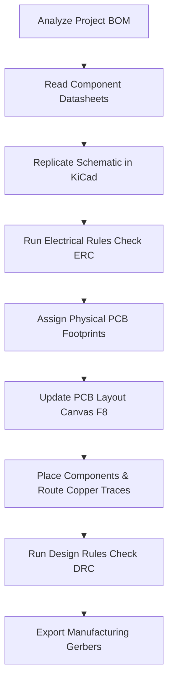
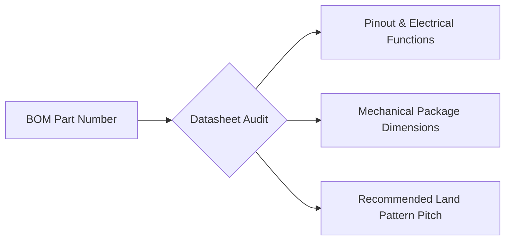
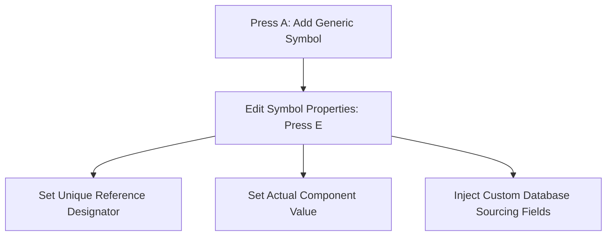
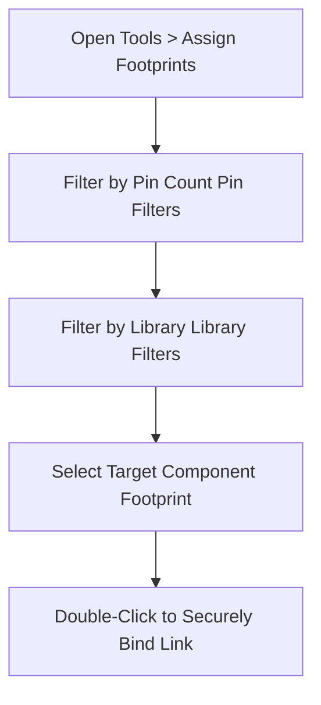
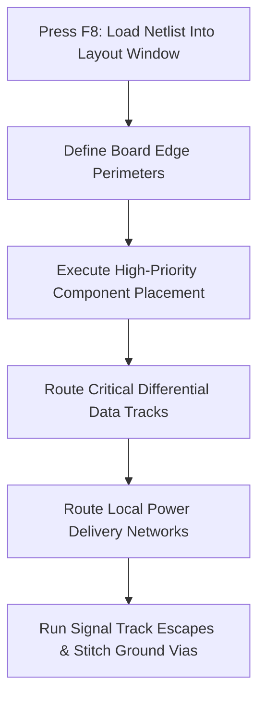
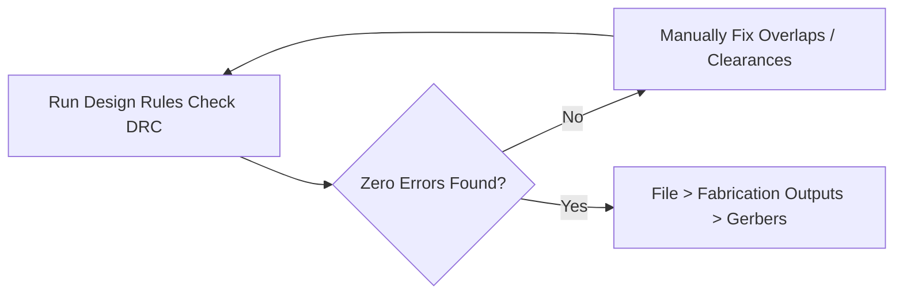

# PCB Design Blueprint: Engineering Workflow Guide

This instruction guide covers the exact engineering procedures required to safely translate a Cadence schematic blueprint, component datasheets, and a Bill of Materials (BOM) into a fully manufactured PCB using KiCad.

---

## 🗺️ Visual Architecture & Workflow Overview

---

## 📑 Section 1: Decoding Datasheets & BOM Verification

Before placing symbols, you must cross-reference your Bill of Materials spreadsheet with the manufacturer datasheets to extract electrical constraints and physical hardware requirements.

### Visual Guide: Datasheet Data Extraction Flow

### Step-by-Step Verification Checklist

1. **Verify Electrical Compatibility:**
   * Open the component datasheet.
   * Locate the **Electrical Characteristics** section.
   * Confirm operating voltage bounds.
   * Check maximum current handling capabilities.
   * Verify the part number matches your BOM string exactly.

2. **Extract Part Packaging Geometry:**
   * Locate the **Package Options** or **Mechanical Drawings** page.
   * Identify the component housing standard name.
   * Check package designation styles:
     * Surface Mount Devices (SMD).
     * Plated Through-Hole (PTH).
   * Note the structural terminal formatting:
     * Flat Gull-Wing leads (e.g., `SSOP-20`).
     * Bottom-pad leads (e.g., `QFN`).
     * Standard dual-row pins (e.g., `DIP-40`).

3. **Decode Packaging Size Codes:**
   * Identify passive component footprint sizing conventions.
   * Map imperial naming to metric dimensional standards:
     * Imperial `0603` maps to Metric `1608`.
     * Imperial `0805` maps to Metric `2012`.
     * Imperial `1206` maps to Metric `3216`.

---

## ⚡ Section 2: Schematic Capture & Metadata Injection

Replicate the electrical circuitry from your original Cadence design file inside the KiCad Schematic Editor canvas.

### Visual Guide: Component Setup Workflow

### Configuration Instructions

* **Symbol Placement Rules:**
  * Use the generic symbol **`R`** for all standard resistors.
  * Use the generic symbol **`C`** for all capacitors.
  * Use the generic symbol **`Ferrite_Bead`** for power filtering inductors.
  * Search by exact product family name for complex IC chips (e.g., type `FT231XS`).

* **Sourcing Data Injection Rules:**
  * Open the Symbol Properties menu using shortcut **`E`**.
  * Click the **`+` (Add Field)** button.
  * Populate tracking properties manually:
    * `Manufacturer` (e.g., `TDK`).
    * `Manufacturer_PartNum` (e.g., `MMZ2012Y202B`).
    * `Distributor` (e.g., `Digikey`).
    * `Distributor_PartNum` (e.g., `445-1561-1-ND`).
  * Uncheck the **Show** visibility checkbox for these tracking properties to maintain a clean schematic layout.

* **Inter-Sheet Connectivity:**
  * Use local green wires for direct connections on a single page.
  * Press **`Ctrl + L`** to initialize a **Global Label** for multi-page nets.
  * Use matching global labels for shared signals (e.g., `USB_TXD`, `USB_RXD`, `MCLRn`).
  * Maintain strict case-sensitivity across all matching labels.

---

## 📐 Section 3: Footprint Pre-Assignment Strategy

Map every abstract logical symbol on your schematic to a physical, scale-accurate geometric land pattern profile on the PCB.

### Visual Guide: Footprint Association Filter

### Selection Instructions

* **Passive Component Association Mapping:**
  * Map `0603` caps and resistors to library footprint **`C_0603_1608Metric`** or **`R_0603_1608Metric`**.
  * Map `0805` parts to library footprint **`R_0805_2012Metric`** or **`L_0805_2012Metric`**.
  * Double-check that your footprint names use the metric dimension suffixes listed on your datasheet package sheets.

* **Connector Hardware Mapping:**
  * Select your USB receptacle component row.
  * Open the **`Connector_USB`** library tab.
  * Select a standardized layout footprint matching your physical mounting layout.
  * Ensure structural shield pads on the layout template match the ground chassis pins of your hardware datasheet drawing.

---

## 🛠️ Section 4: PCB Layout, Component Placement, & Wire Routing

Transfer your complete electrical netlist data to the physical board layout interface and run hardware trace connections.

### Visual Guide: Physical PCB Design Sequence

### Spatial Placement & Routing Instructions

* **Component Placement Controls:**
  * Keep decoupling capacitors physically near their assigned IC power pins.
  * Route power signals through decoupling loops before entering the chip pins.
  * Keep high-frequency crystal oscillators adjacent to microchips to decrease path noise loop areas.
  * Align passive groupings uniformly along shared axes to streamline assembly soldering.

* **Copper Track Routing Specifications:**
  * Press **`X`** to launch the interactive track routing pencil.
  * Avoid running copper tracks at rigid sharp **90-degree corners**.
  * Route copper track bends cleanly using smooth **45-degree angles**.
  * Route critical high-speed data paths (e.g., USB differential tracks `USBDM`, `USBDP`) tightly parallel to one another.
  * Maintain equal total length constraints across differential pairs to prevent timing skew.

* **Ground Plane & Via Integration:**
  * Dedicate a continuous copper fill zone on an entire layer to act as a solid system ground plane.
  * Drop a local grounding via right next to every individual component ground pad.
  * Avoid creating isolated copper islands that cannot establish a direct path back to the main power terminal ground pin.

---

## 🏁 Section 5: Manufacturing Validation Checklist

Verify your board layout data against factory design rules before creating production-ready tooling exports.

1. **Execute Layout Verification Audits:**
   * Open **Tools > Design Rules Checker**.
   * Run the verification loop to scan for track clearance conflicts.
   * Fix disconnected net routes, overlapping trace violations, or text collisions.

2. **Generate Production Export Bundles:**
   * Navigate to **File > Fabrication Outputs > Gerbers (.gbr)**.
   * Select required layers for fabrication (e.g., Copper layers, Solder Mask layers, Silkscreen layers, Edge Cuts).
   * Generate excellent drill files (**`.drl`**) to export all internal hole size coordinates for fabrication drilling machinery.
