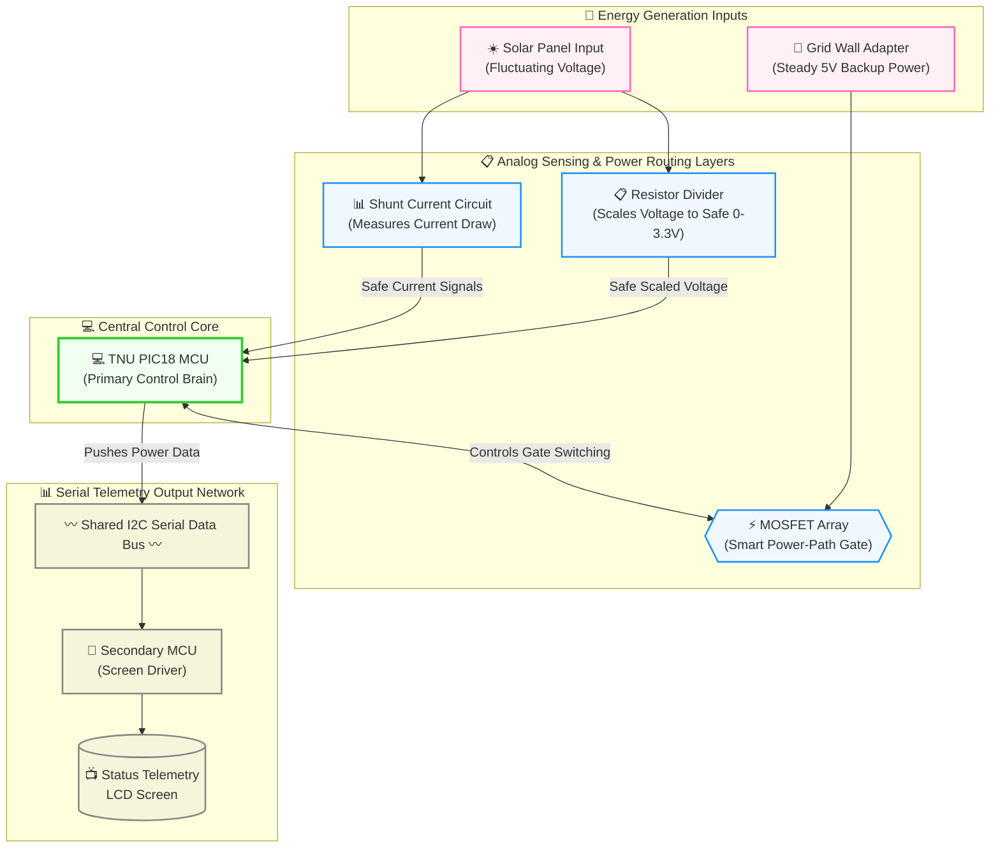

# Campus Eco-Charger ☀️🔋

An intelligent, safe, low-voltage hybrid solar tracking and battery storage utility charging station designed for sustainable mobile device deployment on university campuses.

---

## 1️⃣ Team & Collaboration Status
*   **Jap Ja Mun Pan** (Solo / Lead Systems Engineer)
*   *Project Track:* Independent undergraduate project design. Open to collaborating with external university/industry research groups, and welcoming dedicated student team members passionate about hardware-software integration, power electronics, and embedded control loops.

---

## 2️⃣ Project Overview
The **Campus Eco-Charger** is an all-season, smart microgrid harvesting station engineered to make clean power accessible, reliable, and safe. To eliminate the intermittency flaws of single-source systems, this project coordinates dual-source harvesting assets: an optimized solar array by day and an aerodynamic wind turbine spinner nocturnally or under heavy cloud cover. 

To maximize collection efficiency without manual human adjustment, an active sensor matrix tracks solar positioning from East to West. Crucially, the module utilizes all-season climate sensors to detect freezing temperatures, rain patterns, and winter snow accumulation. If environmental blockages occur, the controller triggers a localized protective hardware state, isolating core sub-systems and preventing structural or circuit wear.

---

## 3️⃣ 📐 System Architecture Diagram

This Top-Down flowchart maps out our energy inputs, high-precision telemetry metrics, primary control core, and serial output networks. GitHub automatically renders this live code text into a visual, color-coded diagram:

---

## 4️⃣ Core Technical Features
*   **Safe Low-Voltage Conversion:** Scales varying input voltages safely down to a locked, highly regulated **5V USB / USB Type-C mobile device delivery profile**.
*   **Automatic Power-Path Management:** Deploys a solid-state MOSFET switching gate array to safely hot-swap power paths between your local battery storage bank and an external grid wall-adapter without short-circuiting.
*   **Under-Voltage Lockout (UVLO):** Continually monitors real-time battery status via code. If voltage drops below safe thresholds, it isolates the cell instantly to prevent deep-discharge degradation and cell death.
*   **Precision Telemetry Sensing:** Implements localized hardware networks (sub-ohm shunt current loops and resistor voltage dividers) to measure real-time DC power, current draw, and net wattage production.
*   **Dual-MCU Communications Bus:** Utilizes an shared local **I2C serial bus** running between a primary TNU PIC18 system brain and a secondary microcontroller tasked with pushing clean metrics to an LCD telemetry screen.

---

## 5️⃣ 📚 Literature Review & Sourcing Links
*Save, track, and read these primary engineering references and manufacturing research papers to support your lab work and design calculations:*

### 🔋 Power Conversion & USB Interface Controls
1. [Low-Cost Solar Mobile Phone Charger Optimization Study](https://researchgate.net) - Peer-reviewed analysis documenting buck tracking circuits built for optimized, stable 5.05V/1.51A portable mobile delivery profiles.
2. [Monolithic Power Systems (MPS): Type-C Power Delivery Controller Guide](https://monolithicpower.cn) - Technical guidelines on setting up CC1/CC2 pin resistance logic to safely manage USB Type-C smartphone handshakes.

### 📊 Analog Front-End & Telemetry Circuitry
3. [Microchip Technical Guide: Getting Started with the PIC18 ADCC Peripheral](https://microchip.com) - Explains how to initialize and configure your specific PIC18 12-bit Analog-to-Digital Converter with Computation registers to mathematically filter out line noise.
4. [Texas Instruments Application Manual: High-Precision Shunt Current Measurement](https://ti.com) - Showcases how to place inline sub-ohm shunts and differential op-amps to read changing fractional currents without damaging microcontrollers.

### 🔌 Safe Switching & Protective Governance
5. [Texas Instruments Brief: Power-Path Routing Management Design Principles](https://ti.com) - Outlines circuit architectures using parallel MOSFET gates to smoothly alternate power lines between main power adapters and battery packs.
6. [Analog Devices Manual: Battery Under-Voltage Lockout (UVLO) Hysteresis Layouts](https://analog.com) - Provides the structural comparator calculations needed to open electronic power isolation switches when a battery enters a critical low-voltage state.

### 🎬 Visual Engineering Blueprints & Tutorials
7. [EEVblog Official KiCad PCB Layout Tutorial](https://youtube.com) - Step-by-step visual training video detailing multi-layer board trace tracking, library symbol management, and footprints verification workflows.
8. [EEVblog Fundamentals: Calculating Resistor Divider Ratios](https://youtube.com) - Core electronics tutorial breaking down Ohm's Law ($V=IR$) calculations to safely step down raw DC lines to safe micro-chip logic parameters.

---

## 🛠️ Hardware & Software Development Environment
*   **ECAD CAD Environment:** KiCad (Custom schematic capture and multi-layer board layouts)
*   **Microcontroller Environment:** TNU PIC18 Hardware Platform (Register-level code configurations)
*   **Communications:** Synchronous I2C Serial Data Bus Network
