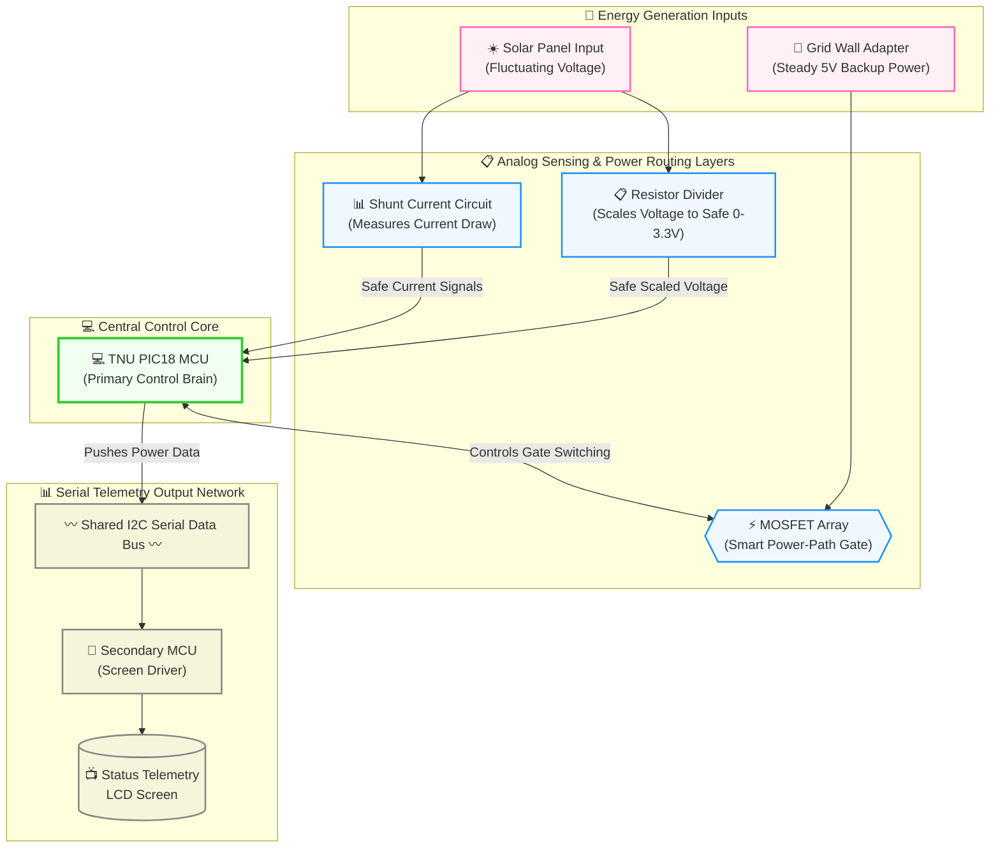

# Campus Eco-Charger ☀️🔋

An intelligent, safe, low-voltage hybrid solar tracking and battery storage utility charging station designed for sustainable mobile device deployment.

## 📐 System Architecture Diagram

## 🎯 Key Project Features
*   **Safe Low-Voltage Conversion:** Optimizes unstable solar panel inputs down to a stable 5V output channel via a highly efficient Buck converter stage.
*   **Dual-Source Smart Power Routing:** Features an integrated solid-state MOSFET switching array to automatically hot-swap power paths between a local battery storage bank and a grid wall-adapter backup line without interrupting device delivery.
*   **Under-Voltage Lockout (UVLO):** Executes a hardware-driven finite state machine (FSM) to isolate and disconnect depleting battery cells before they drop past critical thresholds and suffer permanent cell degradation.
*   **Dual-MCU Communications Bus:** Utilizes a shared I2C data bus running between a primary TNU PIC18 control microcontroller and a secondary screen-driver MCU to feed live electrical metrics to a local telemetry display screen.
